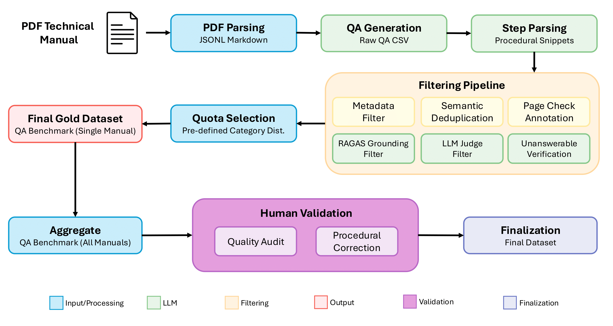

# TechManualQA: A Semi-Automated Pipeline for Technical Manual QA Dataset Generation



This repository contains the official source code for our ECIR 2026 paper: **"A Semi-Automated Pipeline for Synthetic Generation of Grounded, Structurally-Aware QA Datasets for Technical Manuals"**.

Our work presents a novel, semi-automated pipeline that demonstrates how to effectively use long-context Large Language Models (LLMs) for synthetic data generation with an integrated human-in-the-loop validation process. The pipeline processes entire technical manuals at once to generate a diverse set of high-quality questions, which are then refined through a rigorous automated filtering cascade and validated by human annotators to ensure high data quality and factual grounding.

## Key Features

- **End-to-End Pipeline**: From PDF parsing to a final, validated QA dataset
- **Long-Context LLM Strategy**: Processes entire manuals in a single prompt, avoiding complex chunking and retrieval strategies
- **Multi-Stage Filtering Cascade**: Ensures data quality through semantic deduplication, RAGAS-based grounding checks, and an LLM-as-judge
- **Structurally-Aware Generation:** Produces structured datasets (JSONL format) with a principled taxonomy of General, Procedural, and LLM-verified Unanswerable questions
- **Reproducibility Focused**: Includes scripts to reproduce not only the pipeline but also the analysis and figures presented in the paper

## Repository Structure

This repository contains only the source code and documentation. Data files are generated locally when you run the pipeline or can be downloaded from Zenodo.

```
techmanualqa/
├── config/
│   └── settings.yaml.example      # Example configuration template
├── human_validation/
│   └── rater_instructions.md      # Instructions for human annotators
├── prompts/
│   └── master_prompt.txt          # Master prompt for QA generation
├── src/
│   └── techmanualqa/
│       ├── __init__.py
│       ├── analyze_ablation.py
│       ├── create_filtering_table.py
│       ├── create_input_stats_plot.py
│       ├── create_results_table.py
│       ├── create_score_visualizations.py
│       ├── create_zenodo_archive.py
│       ├── generate_candidates.py
│       ├── llm_client.py
│       ├── parse_pdf.py
│       ├── prepare_audit_xlsx.py
│       ├── qa_benchmark.py
│       └── retrieval_benchmark.py
├── .env.example                   # Template for API keys
├── .gitignore                     # Git ignore rules
├── LICENSE                        # MIT License for the code
├── pyproject.toml                 # Project metadata and dependencies
├── README.md                      # This file
└── uv.lock                        # Lock file for dependencies
```

### Generated Directories (Not in Repository)

When you run the pipeline, the following directories will be created locally:

- `data/` - Contains source PDFs and processed data for all 20 manuals
  - `data/pdfs/` - Source manual PDFs (downloaded by you)
  - `data/processed/` - Parsed pages, QA candidates, statistics, and audit files
- `paper_artifacts/` - Generated figures, tables, and benchmark results
- `release/` - Final packaged dataset ready for distribution

## Dataset

The **TechManualQA-700** dataset contains 700 high-quality question-answer pairs across 20 technical manuals, covering diverse domains including consumer electronics, power tools, home appliances, vehicles, and robotics. The dataset includes:

- **General Questions**: Factual questions about specifications, features, and definitions
- **Procedural Questions**: Step-by-step instructions and how-to queries
- **Unanswerable Questions**: LLM-verified questions that cannot be answered from the manual

Each question includes:
- Ground truth answer snippet
- Page number reference
- Question category/taxonomy
- Multiple quality scores (faithfulness, correctness, judge scores)
- Human validation results

### Accessing the Dataset

**Option 1: Download the Complete Dataset (Recommended)**

The final TechManualQA-700 dataset is available on Zenodo:

🔗 **[Download from Zenodo](https://zenodo.org/records/17410809)**

This includes:
- Complete JSONL file with all 700 QA pairs
- Human validation annotations
- Dataset documentation and license

**Option 2: Reproduce the Dataset from Source**

To run the complete pipeline and generate the dataset yourself:

1. Download the source manuals (see [Covered Manuals](#covered-manuals) section below for links)
2. Place PDFs in a `data/pdfs/` directory
3. Follow the [Usage](#usage) instructions to run the pipeline

**Note**: The `data/`, `release/`, and `paper_artifacts/` directories are not included in this repository as they contain large generated files. These will be created when you run the pipeline.

## Setup and Installation

### Prerequisites

- Python 3.10 or later
- API keys for Google (Gemini models) and OpenAI (GPT-4)
- (Optional) LiteLLM API key for proxy endpoint

### 1. Clone the Repository

```bash
git clone https://github.com/yourusername/techmanualqa.git
cd techmanualqa
```

### 2. Create a Virtual Environment

```bash
python -m venv venv
source venv/bin/activate  # On Windows: venv\Scripts\activate
```

### 3. Install Dependencies

This project uses modern Python packaging with `pyproject.toml`. You can install using either `pip` or `uv`:

**Option A: Using uv (Recommended - Faster)**

[uv](https://github.com/astral-sh/uv) is a fast Python package installer and resolver.

```bash
# Install uv if you don't have it
curl -LsSf https://astral.sh/uv/install.sh | sh

# Install project dependencies
uv pip install -e .
```

**Option B: Using pip**

```bash
pip install -e .
```

Both methods will install all dependencies specified in `pyproject.toml`. The `-e` flag installs in editable mode, useful for development.

### 4. Set Up API Keys

Create a `.env` file in the root directory:

```bash
# Get your Google API key from Google AI Studio
GOOGLE_API_KEY="YOUR_GOOGLE_API_KEY_HERE"

# Get your OpenAI API key from the OpenAI platform
OPENAI_API_KEY="YOUR_OPENAI_API_KEY_HERE"

# (Optional) Get your LiteLLM API key from the LiteLLM platform
LITELLM_API_KEY="YOUR_LITELLM_API_KEY_HERE"
LITELLM_ENDPOINT="YOUR_LITELLM_ENDPOINT_HERE"
```

**Important**: The `.env` file should never be committed to version control.

## Usage

### Running the Pipeline

The pipeline consists of several stages:

#### 1. Parse PDF to Markdown

```bash
python src/techmanualqa/parse_pdf.py path/to/manual.pdf
```

This converts the PDF into a structured JSONL file with page-level markdown content.

#### 2. Generate and Filter QA Candidates

```bash
python src/techmanualqa/generate_candidates.py -i data/processed/manual_name/manual_name_pages.jsonl
```

This script:
- Generates QA candidates using the LLM
- Applies the filtering cascade (semantic deduplication, grounding checks, LLM judge)
- Outputs filtered candidates and audit files

#### 3. Prepare Human Audit Files

```bash
python src/techmanualqa/prepare_audit_xlsx.py
```

Creates Excel spreadsheets for human annotators to validate the generated questions.

#### 4. Create Final Dataset Archive

```bash
python src/techmanualqa/create_zenodo_archive.py
```

Packages the dataset with human annotations into a distributable archive.

### Running Benchmarks

#### QA Benchmark

```bash
python src/techmanualqa/qa_benchmark.py
```

Evaluates the QA capabilities of different models on the dataset.

#### Retrieval Benchmark

```bash
python src/techmanualqa/retrieval_benchmark.py
```

Evaluates retrieval performance using different strategies.

### Reproducing Paper Artifacts

Generate the figures and tables from the paper:

```bash
# Generate input statistics plot
python src/techmanualqa/create_input_stats_plot.py

# Generate filtering cascade statistics table
python src/techmanualqa/create_filtering_table.py

# Generate score distribution visualizations
python src/techmanualqa/create_score_visualizations.py

# Generate results tables
python src/techmanualqa/create_results_table.py

# Analyze filter complementarity (ablation study)
python src/techmanualqa/analyze_ablation.py
```

Alternatively, if you installed the package with `pip install -e .`, you can use the convenient command-line tools:

```bash
tech-parse-pdf
tech-generate-candidates
tech-retrieval-benchmark
tech-qa-benchmark
tech-prepare-audit-xlsx
tech-input-stats-plot
tech-filtering-table
tech-score-viz
tech-results-table
tech-analyze-ablation
```

Outputs will be saved in the `paper_artifacts/` directory.

## Covered Manuals

The dataset includes 20 technical manuals across diverse categories:

**Consumer Electronics:**
- [Apple Watch](https://help.apple.com/pdf/watch/8/en_US/apple-watch-user-guide-watchos8.pdf) - User Guide watchOS 8
- [Samsung Galaxy Z Fold5](https://www.att.com/scmsassets/support/wireless/sam-f946-f731-en-um-os13-072723-final.pdf) - User Manual
- [Nintendo 2DS XL](https://files.bbystatic.com/qJXVomkSkcTE%2FsqNxZEBqQ%3D%3D/6d6f5044-956b-42b8-96dd-d5a315cc389c.pdf) - Operations Manual
- [LG Home Theater](https://research.encompass.com/ZEN/om/LFD750.pdf) - Owner's Manual

**Power Tools:**
- [DeWalt Saw](https://www.dewalt.com/GLOBALBOM/QU/DWE575/1/Instruction_Manual/EN/NA477368_DWE574_DWE575_DWE575SB_T1__NA.pdf) - Instruction Manual
- [Makita Drill](https://cdn.makitatools.com/apps/cms/doc/prod/XFD/e2dc6a61-63d3-4455-b4dc-940ffa84e99d_XFD12_IM_885510-943.pdf) - Instruction Manual
- [Hilti Hammer Drill](https://www.hilti.com/medias/sys_master/documents/h76/ha2/10131929923614/Operating-Instruction-TE-60-04-Operating-Instruction-PUB-5277961-000.pdf) - Operating Instructions
- [Prusa MK4 3D Printer](https://www.prusa3d.com/downloads/manual/prusa3d_manual_mk4s_mk39s_101_en.pdf) - User Manual

**Home Appliances:**
- [Bosch Oven](https://media3.bosch-home.com/Documents/9001011473_B.pdf) - Instruction Manual
- [Electrolux Oven](https://api.electrolux-medialibrary.com/asset/4b56e9de-8538-42a2-89b5-709504fc7cc4/E4RM3Q/a1f348c3-47b1-4fa0-bec6-7ddf9cc5aef4/PDF/a1f348c3-47b1-4fa0-bec6-7ddf9cc5aef4.pdf) - User Manual
- [Dyson v12 Vacuum](https://www.dyson.com/content/dam/dyson/maintenance/user-guides/en_anz/vacuums/ANZ_620d_dyson-v12-detect-slim_user-manual.pdf) - User Manual
- [Miele Dishwasher](https://www.miele.com.cy/images/stories/virtuemart/product/11200110-000-00_11200110-00.pdf) - Operating Instructions
- [Miele Heat Pump Dryer](https://www.miele.com.cy/images/stories/virtuemart/product/11365160-000-00_11365160-00.pdf) - Operating Instructions

**Computers:**
- [Lenovo ThinkPad X1](https://download.lenovo.com/pccbbs/thinkcentre_pdf/tc_x1_ug_en.pdf) - User Guide

**Vehicles:**
- [Ford Mustang Mach-E](https://www.fordservicecontent.com/Ford_Content/Catalog/owner_information/2025_CX727_MachE_Owner_Manual_ENG_v1.pdf) - Owner's Manual
- [Tesla Model S](https://www.tesla.com/ownersmanual/models/en_us/Owners_Manual.pdf) - Owner's Manual

**Drones & Robotics:**
- [DJI Mavic Pro](https://dl.djicdn.com/downloads/mavic/Mavic+Pro+User+Manual+V2.0-.pdf) - User Manual
- [Boston Dynamics Spot](https://static.generation-robots.com/media/user-manual-spot-boston-dynamics-en.pdf) - User Manual

**Medical Devices:**
- [Omron Blood Pressure Monitor](https://medaval.ie/docs/manuals/Omron-HEM-7200-E-Manual.pdf) - Instruction Manual

**Note**: All manuals are publicly available. Please respect the original manufacturers' licenses and terms of use.

## Citation

If you use our pipeline, code, or dataset in your research, please cite our paper:

```bibtex
@inproceedings{duricic2026techmanualqa,
  author    = {Duricic, Tomislav and ElSayed, Neven and Kopeinik, Simone and Lacic, Emanuel and Helic, Denis and Kowald, Dominik and Veas, Eduardo},
  title     = {A Semi-Automated Pipeline for Synthetic Generation of Grounded, Structurally-Aware QA Datasets for Technical Manuals},
  booktitle = {TBD},
  year      = {2026},
  publisher = {TBD},
}
```

## Contact

For questions or issues, please open an issue on GitHub or contact the authors.

## Related Resources

- Paper preprint: [Coming soon]
- [Dataset on Zenodo](https://zenodo.org/records/17410809)
